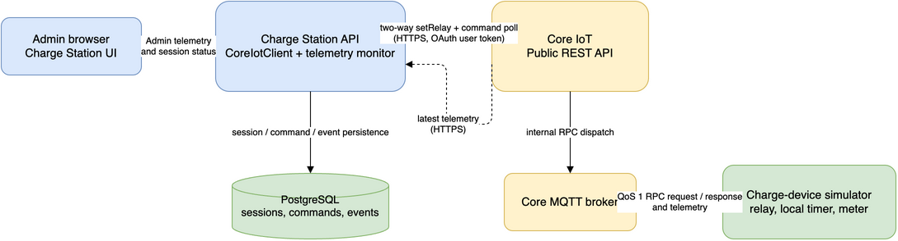

# Charge Station Direct Core IoT Design

**Status:** Approved architecture — implementation pending

## Goal

Replace the runtime mock IoT path with a real end-to-end path from Charge
Station API to Core IoT. Charge Station controls a device relay with Core's
two-way RPC API, monitors Core telemetry, and exposes live electrical readings
in the existing Admin UI. A separate MQTT device simulator represents the
physical charging device and owns the charging timer.

## Constraints

- Charge Station API calls Core IoT public HTTP APIs directly; `iot-service`
  must not run in Compose or participate in command delivery.
- Core IoT source, the currently running Core instance, and its database are
  out of scope. The isolated Core instance is the integration target.
- Core's device transport remains MQTT. The simulator is the only component
  that uses the device MQTT token.
- The relay timer is authoritative in the simulator, never in Charge Station.
- Core OAuth and MQTT device tokens are runtime secrets. They are supplied via
  ignored local environment files and never committed.
- Local payment checkout can remain PayOS mock; it is outside the IoT path.

## Architecture



```text
Admin browser
  -> Charge Station API -> Core IoT Public REST API -> Core MQTT -> simulator
       |                       ^                           |
       +---- PostgreSQL -------+------ telemetry -----------+
```

The API owns orchestration, command persistence, status transitions, and the
Admin API. Core owns command transport and telemetry storage. The simulator
owns relay state, electrical measurements, and automatic timer expiry.

## Components

### CoreIotClient in Charge Station API

`CoreIotClient` is a Nest provider in `apps/charge-station-api/src/iot`. It
uses only Core's public endpoints:

- `POST /api/v1/devices/{deviceId}/commands`
- `GET /api/v1/commands/{commandId}`
- `GET /api/v1/telemetry/{deviceId}`

For a start command it submits:

```json
{
  "method": "setRelay",
  "mode": "two_way",
  "params": {
    "relayId": "relay-1",
    "enabled": true,
    "durationSeconds": 3600,
    "sessionId": "<charge-station-session-id>"
  }
}
```

For a stop command it submits the same method with `enabled: false`. Every
request has an `Idempotency-Key` derived from the persisted Charge Station
command ID. The client polls the Core command record until it is `responded`,
then accepts only a response with `ok: true`. An expired, rejected, malformed,
or timed-out Core command is surfaced as a command failure; it is never
reported as a successful relay transition.

The existing `station.deviceId` becomes the authoritative Core device ID. The
seed uses `IOT_CORE_DEVICE_ID` to update `ST01`, including an already seeded
local development database. `IOT_CORE_RELAY_ID` defaults to `relay-1` for the
current one-relay-per-station simulator.

### Command and session transitions

The command dispatcher stops calling `IOT_SERVICE_URL`. It invokes
`CoreIotClient` and, after a successful two-way response, calls the existing
`DeviceEventsService` in-process:

- Start: persist `COMMAND_ACCEPTED`, then `RUNNING` after the simulator's Core
  response confirms the relay is on.
- Stop: persist `STOPPED` only after the Core response confirms the relay is
  off. The event remains correlated with the original start command so the
  existing state machine and device-ID validation continue to work.
- Failure: retain the current retry and start-failure semantics; no synthetic
  successful device event is generated.

The typed internal command payload carries the Core `deviceId`, `relayId`, and
the originating start command ID where needed. This prevents a stop after an
API restart from relying on in-memory simulator state.

### Core telemetry monitor

`CoreTelemetryMonitor` runs inside Charge Station API after the HTTP server is
ready. It obtains active sessions and their original start commands from
PostgreSQL, reads each mapped Core device's recent telemetry, and uses the
latest record because Core telemetry is returned in ascending event order.

For matching simulator telemetry it sends existing in-process device events:

- Relay on with matching `session_id`: `HEARTBEAT`, including
  `remainingSeconds`.
- Relay off with `last_stop_reason: TIMER_EXPIRED`: `STOPPED` with
  `TIMER_EXPIRED`, correlated to the start command.
- No fresh telemetry for the configured stale interval: `DEVICE_OFFLINE` once
  until a later fresh telemetry record is observed.

The monitor compares telemetry timestamps with the session's last device event
timestamp, so it does not create duplicate heartbeat records on every poll.
The database is the recovery source after an API restart; no separate runtime
state file is required.

### MQTT charge-device simulator

A dedicated Compose sidecar uses its own Core device token to connect to
`host.docker.internal:18893`. It subscribes at QoS 1 to
`v1/devices/me/rpc/request/+` and replies at QoS 1 to the matching
`v1/devices/me/rpc/response/{commandId}` topic.

It implements `setRelay` as follows:

- Valid start sets relay state on, stores `sessionId`, starts a local timer for
  `durationSeconds`, and responds `{ "ok": true, "result": ... }`.
- Valid stop cancels the local timer, turns the relay off, and responds with
  the observed state.
- Expiry turns the relay off locally and marks `last_stop_reason` as
  `TIMER_EXPIRED`.

It continuously publishes QoS 1 telemetry to `v1/devices/me/telemetry`:

```json
{
  "relay_state": true,
  "session_id": "<optional-session-id>",
  "remaining_seconds": 3540,
  "last_stop_reason": null,
  "voltage_v": 230.4,
  "current_a": 10.2,
  "power_w": 2350.0,
  "energy_kwh": 0.0174
}
```

Power and current are zero while the relay is off; energy accumulates only
while it is on. The simulator is not a Charge Station mock: it is an MQTT
device using Core's actual protocol.

### Admin telemetry UI

`AdminService.getStations()` reads latest telemetry through `CoreIotClient` for
each station with a device mapping. The browser receives only the sanitized
latest reading, never a Core token. Each station/connector row shows relay
state, voltage (V), current (A), power (W), energy (kWh), remaining time, and
sample time. A Core timeout, unavailable device mapping, malformed telemetry,
or absent sample produces a visible `Telemetry unavailable` state without
failing the entire Admin page.

## Runtime configuration

Charge Station API receives:

```text
IOT_CORE_PUBLIC_URL=http://host.docker.internal:18090
IOT_CORE_ACCESS_TOKEN=<user-a OAuth access token>
IOT_CORE_DEVICE_ID=01a0d6d4-8bd1-7552-a060-44438530d1ef
IOT_CORE_RELAY_ID=relay-1
IOT_CORE_COMMAND_TIMEOUT_MS=10000
IOT_CORE_COMMAND_POLL_MS=250
IOT_CORE_TELEMETRY_POLL_MS=2000
IOT_CORE_TELEMETRY_STALE_MS=15000
```

The simulator alone additionally receives:

```text
IOT_CORE_MQTT_HOST=host.docker.internal
IOT_CORE_MQTT_PORT=18893
IOT_CORE_DEVICE_TOKEN=<device token>
```

`user-a` has the required Core user permissions and OAuth scopes
`commands:read`, `commands:write`, `devices:read`, and `telemetry:read`.
Core's public command endpoint requires a user principal; a client-credentials
token is not sufficient. This local implementation uses an injected delegated
token. Production requires a secure renewal/delegation design before its token
expires.

## Compose and migration impact

- Remove the `iot-service` service and its event-journal volume from Compose.
- Remove mock-specific environment variables from runtime configuration.
- Retire the mock service from production/test execution after equivalent Core
  tests replace its behavioral coverage.
- Keep database migrations unnecessary: `stations.device_id` already exists.

## Verification

Automated coverage must include:

- Core request construction, idempotency, polling, success, rejection, and
  timeout behavior.
- Start/stop event emission only after the matching successful Core response.
- Telemetry monitor heartbeat, timer-expiry, stale-device, and restart recovery
  behavior.
- Admin API/UI rendering of valid telemetry and unavailable telemetry.
- Compose configuration with no running `iot-service`.

The real E2E proof is:

1. Start the isolated Core instance and the MQTT simulator.
2. Confirm Core receives fresh electrical telemetry.
3. Create and complete a local Charge Station order.
4. Verify Core records a two-way `setRelay` command and simulator responds.
5. Verify the session becomes `CHARGING` and Admin shows non-zero electrical
   readings.
6. Stop the session; verify Core response, relay-off telemetry, and the session
   becomes `CANCELLED`.
7. Submit a short direct simulator command and verify its local timer produces
   `TIMER_EXPIRED` and the relay returns off.
